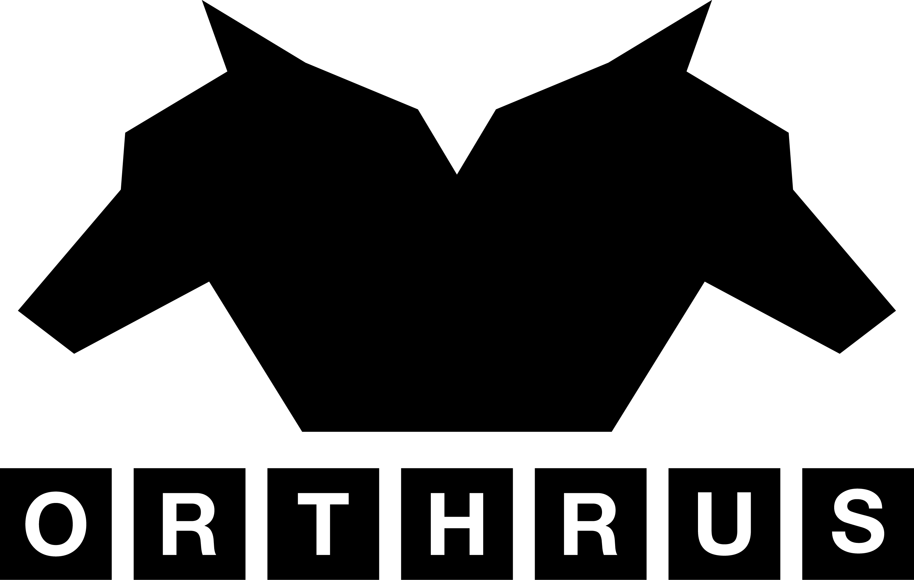

# Orthrus

Orthrus is a HID/keystroke injection device written in CircuitPython, primarily for the Adafruit M4 Airlift.

Scripts are written in OSL (Orthrus Scripting Language) and the following commands are currently available:

| \\textbf\{Command\}               | \\textbf\{Description\}                                |
|-----------------------------------|--------------------------------------------------------|
| K: \<KEYCODE>                      | Keycode command                                        |
| C: \<CCC>                          | Consumer control code command                          |
| S: \<STRING>                       | HID injects string                                     |
| SL: \<STRING>                      | HID injects string and presses ENTER                   |
| LOOP: \<INT>                       | Demarcates the beginning of the loop and loops n times |
| ELOOP                             | Demarcates the end of the loop                         |
| VAR: \<NAME>, \<VALUE>              | Sets variable                                          |
| \{\{\<VAR NAME>\}\}                | Use variable                                           |
| OSL:  \<PATH \(as string\)>        | Run  external OSL fragments within an OSL script       |
| M\[move\]: X\(\<INT>\), Y\(\<INT>\) | Moves the mouse \(X, Y coordinates\)                   |
| M\[click\]                        | Clicks the mouse \(right or left mouse button\)        |
| EP:  \<PATH \(as string\)>         | Injects external payload                               |
| SLEEP: \<FLOAT>                    | Sleeps for n seconds until executing next line         |
| SER: \<STRING>                     | Print string to serial console                         |
| QUIT                              | Quits the routine/script                               |

## Installation

## Running

## Required libraries

## Acknowledgements

## Todo and planned features

* Automatic obfuscation (Missing zlib; EP should be pre-obfuscated anyway)
* OLED screen control
* Wifi enabled control
* Duckyscript -> OSL
* Joystick support
* Add counter
* Neopixel control